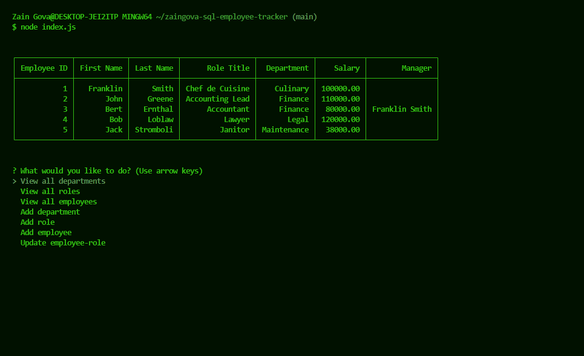

# SQL Employee Management App

## Description

This is a command-line application that lets employers manager their employees, and the departments they belong to/the roles they carry out.

## Visuals

Demo screen-shots of the working application

demo.mp4

## Resources

1. [Console-table-printer](https://www.npmjs.com/package/console-table-printer)
2. [Inquirer](https://www.npmjs.com/package/inquirer?activeTab=readme)
3. [Node MySQL 2](https://www.npmjs.com/package/mysql2)

## Usage

[Click here to be redirected to the Github repository!](https://github.com/zaingova/zaingova-sql-employee-tracker)

You can start the application by running the schema SQL file using mySQL, then running the index.js file with the 'node index.js' command in the command line. Then, follow the prompts in the terminal to add/review data for employees, departments, and roles.

## License

This project uses The MIT Licece. Click on the banner at either below or at the top of the page for more information.

